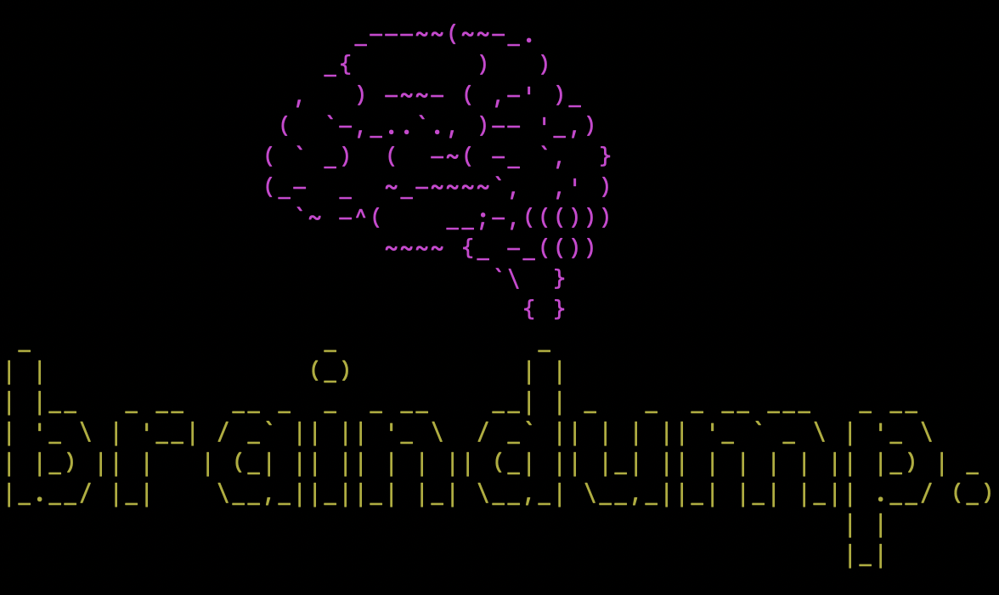
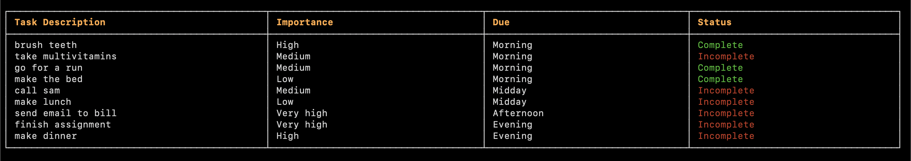

## Description

Do you ever struggle to manage your daily schedule? Ever wonder which tasks to do first, and which ones to save for later? This CLI app lets you add your daily tasks in the morning, and then tells you which order you should do them. It plans your day, so that you don't have to.

## Resources

- [Source Code](https://github.com/marlonmoreira000/scheduler-app/tree/master/src)
- [Documentation](https://github.com/marlonmoreira000/scheduler-app/tree/master/docs)
- [Unit Tests](https://github.com/marlonmoreira000/scheduler-app/tree/master/spec)

## App features

#### 1. Add tasks

Users can add as many tasks as they want to their schedule. To add a task, users must provide a task description, and tell the app when it is due, and how important it is. 

#### 2. Delete tasks

Users can delete one or more tasks from their schedule.
They need to confirm that they want to delete, before deletion. 

#### 3. Mark tasks as complete

Users can mark one or more tasks for completion. This will be shown in the schedule as 'complete' (in green text).

#### 4. See schedule

User's daily tasks are sorted, based on when they are due, and how important they are. This makes sure that the most important tasks are completed first. The schedule also colors tasks according to their status, 'complete' (in green) or 'incomplete' in red.

#### 5. Clear schedule

Users can clear their entire schedule anytime, allowing them to start fresh every day.

## Screenshots



## How to Install and Run

1. [Install Ruby](https://www.ruby-lang.org/en/documentation/installation/) if you do not have it.
2. Clone the Braindump project from the [source code](https://github.com/marlonmoreira000/scheduler-app)
   
```
$ git clone https://github.com/marlonmoreira000/braindump-app.git
```

3. In your terminal, change directory into the root folder of the project repo you just cloned.

```
$ cd braindump-app
```

4. Install the Ruby gem `bundler` if you do not have it

```
$ gem install bundler
```

5. Install the required project gems 

```
$ bundle install 
```

6. Make the program executable
```
$ chmod +x run.sh
```

7. Run the app

```
$ ./run.sh
```

8. (Optional) If you want to run the app with a username, you can provide a parameter when you run the script. For example,

```
$ ./run.sh john
```

Your username will be displayed inside the app while it is running. Default username is 'guest'.

##  System Requirements

This app can be run on all major operating systems. See [Gemfile](https://github.com/marlonmoreira000/scheduler-app/blob/master/Gemfile) for required Ruby gems.

## Testing

Unit tests were done using RSpec. Multiple unit tests were done for each class in the program. They can be accessed [here](https://github.com/marlonmoreira000/scheduler-app/tree/master/spec).

## Techniques 

The main coding techniques used to create this app are:  

- Classes and Objects
- Ruby Modules (similar to Java Interfaces)
- Persistent storage (JSON)
- Git and GitHub
- File-handling
- Error-handling


